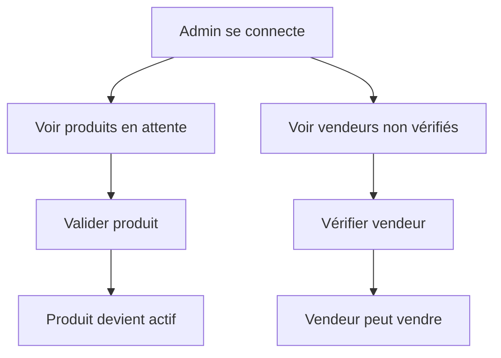
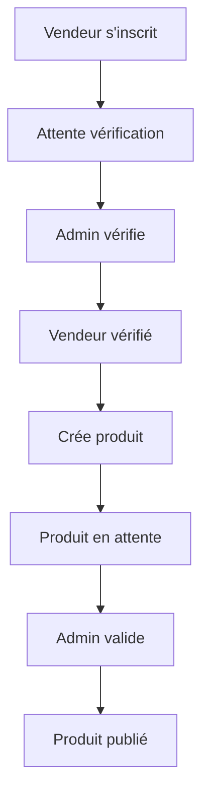
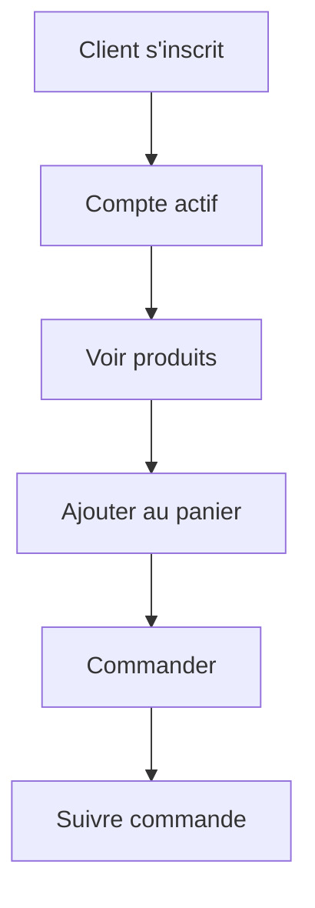

# ✅ Implémentation Complète du Système d'Authentification Afrizar

## 📝 Résumé

Ce document résume l'implémentation complète du système d'authentification multi-rôles pour la plateforme Afrizar.

## 🎯 Objectif Accompli

Mise en place d'un système d'authentification complet avec gestion des rôles permettant :
- ✅ Différents profils utilisateurs (Admin, Client, Vendeur, Support)
- ✅ Permissions spécifiques par rôle
- ✅ Validation des produits par l'admin avant publication
- ✅ Vérification des vendeurs par l'admin
- ✅ Compte admin créé automatiquement au démarrage
- ✅ Tokens JWT avec informations de rôle

## 📁 Fichiers Créés/Modifiés

### Nouveaux Contrôleurs
1. **`AdminController.java`** - Gestion complète de l'administration
   - Validation des produits
   - Gestion des vendeurs
   - Gestion des utilisateurs
   - Statistiques dashboard

2. **`SupportController.java`** - Fonctionnalités du support client
   - Consultation des clients et vendeurs
   - Gestion des commandes
   - Assistance utilisateurs
   - Statistiques support

### Services Améliorés

3. **`ProduitService.java`** & **`ProduitServiceImpl.java`**
   - Méthodes de validation de produits
   - Gestion des produits en attente
   - Compteurs statistiques

4. **`VendeurService.java`** & **`VendeurServiceImpl.java`**
   - Vérification des vendeurs
   - Gestion des vendeurs non vérifiés
   - Compteurs statistiques

5. **`AuthService.java`** & **`AuthServiceImpl.java`**
   - JWT enrichi avec rôle et ID utilisateur
   - Extraction du rôle depuis le token
   - Extraction de l'ID utilisateur depuis le token

6. **`InitialisationService.java`**
   - Création automatique du compte admin
   - Création automatique du compte support
   - Initialisation au démarrage

7. **`ClientService.java`** & **`ClientServiceImpl.java`**
   - Compteur de clients pour statistiques

8. **`CommandeService.java`** & **`CommandeServiceImpl.java`**
   - Récupération paginée de toutes les commandes

### Repositories Mis à Jour

9. **`ProduitRepository.java`**
   - Méthodes de recherche par statut avec pagination
   - Compteurs par statut

10. **`VendeurRepository.java`**
    - Recherche des vendeurs par statut de vérification
    - Compteurs de vendeurs

11. **`UtilisateurRepository.java`**
    - Recherche par rôle avec pagination
    - Compteur d'utilisateurs actifs

### Documentation

12. **`GUIDE_AUTHENTIFICATION_ROLES.md`** - Guide complet d'utilisation
13. **`AUTHENTIFICATION_IMPLEMENTATION_COMPLETE.md`** - Ce fichier

## 🚀 Fonctionnalités Implémentées

### Pour l'ADMIN

#### 1. Gestion des Produits
```
GET    /api/admin/produits/en-attente          # Voir les produits à valider
GET    /api/admin/produits/tous                # Voir tous les produits
PATCH  /api/admin/produits/{id}/valider        # Valider un produit
PATCH  /api/admin/produits/{id}/rejeter        # Rejeter un produit
```

#### 2. Gestion des Vendeurs
```
GET    /api/admin/vendeurs/tous                # Tous les vendeurs
GET    /api/admin/vendeurs/non-verifies        # Vendeurs à vérifier
PATCH  /api/admin/vendeurs/{id}/verifier       # Vérifier un vendeur
PATCH  /api/admin/vendeurs/{id}/desactiver     # Désactiver un vendeur
PATCH  /api/admin/vendeurs/{id}/activer        # Activer un vendeur
```

#### 3. Gestion des Utilisateurs
```
GET    /api/admin/utilisateurs/tous            # Tous les utilisateurs
PATCH  /api/admin/utilisateurs/{id}/desactiver # Désactiver un utilisateur
PATCH  /api/admin/utilisateurs/{id}/activer    # Activer un utilisateur
```

#### 4. Statistiques
```
GET    /api/admin/statistiques/dashboard       # Dashboard complet
```

### Pour le SUPPORT

```
GET    /api/support/clients                    # Liste des clients
GET    /api/support/vendeurs                   # Liste des vendeurs
GET    /api/support/commandes                  # Toutes les commandes
POST   /api/support/clients/{id}/ajouter-points  # Ajouter des points
GET    /api/support/statistiques/clients       # Stats clients
GET    /api/support/statistiques/vendeurs      # Stats vendeurs
```

### Pour le VENDEUR

```
POST   /api/produits                           # Créer un produit
PUT    /api/produits/{id}                      # Modifier son produit
GET    /api/produits/vendeur/{id}              # Voir ses produits
PATCH  /api/produits/{id}/stock                # Mettre à jour le stock
```

### Pour le CLIENT

```
GET    /api/produits                           # Voir les produits actifs
POST   /api/commandes                          # Passer une commande
GET    /api/commandes/mes-commandes            # Voir ses commandes
GET    /api/clients/profil                     # Voir son profil
```

## 🔐 Sécurité

### JWT Token Enrichi

Le token JWT contient maintenant :
```json
{
  "sub": "email@example.com",
  "role": "ADMIN",
  "userId": 1,
  "nom": "Nom",
  "prenom": "Prenom",
  "iat": 1234567890,
  "exp": 1234654290
}
```

### Filtres de Sécurité

1. **JwtAuthenticationFilter** - Vérifie et extrait le JWT
2. **RateLimitingFilter** - Limite les requêtes
3. **SecurityHeadersFilter** - Ajoute les en-têtes de sécurité
4. **SecurityExceptionHandler** - Gère les erreurs de sécurité

### Configuration Spring Security

```java
// Admin uniquement
.requestMatchers("/api/admin/**").hasRole("ADMIN")

// Admin ou Support
.requestMatchers("/api/statistiques/**").hasAnyRole("ADMIN", "SUPPORT")
.requestMatchers("/api/support/**").hasAnyRole("ADMIN", "SUPPORT")

// Vendeur ou Admin
.requestMatchers("/api/vendeurs/**").hasAnyRole("VENDEUR", "ADMIN")
.requestMatchers("POST", "/api/produits/**").hasAnyRole("VENDEUR", "ADMIN")

// Client ou Admin
.requestMatchers("/api/clients/**").hasAnyRole("CLIENT", "ADMIN")
.requestMatchers("/api/commandes/**").hasAnyRole("CLIENT", "ADMIN")
```

## 🎬 Workflow Complet

### Workflow Admin



### Workflow Vendeur



### Workflow Client



## 🛠️ Installation et Configuration

### 1. Prérequis
- Java 17+
- Maven 3.8+
- MySQL/PostgreSQL
- IDE (IntelliJ IDEA, Eclipse, VS Code)

### 2. Configuration Base de Données

**`application.properties`**
```properties
spring.datasource.url=jdbc:mysql://localhost:3306/afrizar
spring.datasource.username=root
spring.datasource.password=votremotdepasse

spring.jpa.hibernate.ddl-auto=update
spring.jpa.show-sql=true

# JWT Configuration
app.jwt.secret=votre_secret_securise_minimum_32_caracteres
app.jwt.expiration=86400000
```

### 3. Démarrage

```bash
# Cloner le projet
git clone <repository-url>
cd Afrizar_Back_End

# Installer les dépendances
mvn clean install

# Lancer l'application
mvn spring-boot:run
```

### 4. Vérification

```bash
# Test du backend
curl http://localhost:8080/api/auth/test

# Connexion admin
curl -X POST http://localhost:8080/api/auth/connexion \
  -H "Content-Type: application/json" \
  -d '{
    "email": "admin@afrizar.sn",
    "motDePasse": "Admin@123"
  }'
```

## 📊 Statistiques Dashboard Admin

Le dashboard admin affiche :
```json
{
  "produits": {
    "total": 150,
    "actifs": 120,
    "enAttente": 30
  },
  "vendeurs": {
    "total": 45,
    "verifies": 38,
    "nonVerifies": 7
  },
  "clients": {
    "total": 1250
  },
  "utilisateurs": {
    "total": 1295,
    "actifs": 1280,
    "inactifs": 15
  }
}
```

## 🔑 Comptes par Défaut

### Admin
```
Email: admin@afrizar.sn
Mot de passe: Admin@123
Rôle: ADMIN
```

### Support (créé automatiquement)
```
Email: support@afrizar.sn
Mot de passe: Support@123
Rôle: SUPPORT
```

⚠️ **IMPORTANT** : Changez ces mots de passe en production !

## 🧪 Tests

### Test Inscription Client
```bash
curl -X POST http://localhost:8080/api/auth/inscription \
  -H "Content-Type: application/json" \
  -d '{
    "nom": "Diop",
    "prenom": "Fatou",
    "email": "fatou@example.com",
    "motDePasse": "SecurePass123!",
    "telephone": "+221771234567",
    "role": "CLIENT",
    "adresse": "Dakar",
    "ville": "Dakar",
    "pays": "Sénégal"
  }'
```

### Test Inscription Vendeur
```bash
curl -X POST http://localhost:8080/api/auth/inscription \
  -H "Content-Type: application/json" \
  -d '{
    "nom": "Ndiaye",
    "prenom": "Moussa",
    "email": "moussa@example.com",
    "motDePasse": "SecurePass123!",
    "telephone": "+221771234568",
    "role": "VENDEUR",
    "nomBoutique": "Boutique Moussa",
    "description": "Vêtements traditionnels",
    "adresseBoutique": "Marché Sandaga, Dakar",
    "specialites": "Boubous, Bijoux"
  }'
```

### Test Validation Produit (Admin)
```bash
# 1. Connexion admin et récupération du token
TOKEN=$(curl -X POST http://localhost:8080/api/auth/connexion \
  -H "Content-Type: application/json" \
  -d '{"email":"admin@afrizar.sn","motDePasse":"Admin@123"}' \
  | jq -r '.token')

# 2. Valider un produit
curl -X PATCH http://localhost:8080/api/admin/produits/1/valider \
  -H "Authorization: Bearer $TOKEN"
```

## 📚 Documentation API

### Swagger UI
Accédez à la documentation interactive :
```
http://localhost:8080/swagger-ui.html
```

### OpenAPI JSON
```
http://localhost:8080/v3/api-docs
```

## 🐛 Débogage

### Activer les logs détaillés

**`application.properties`**
```properties
# Logs Spring Security
logging.level.org.springframework.security=DEBUG

# Logs Hibernate/SQL
logging.level.org.hibernate.SQL=DEBUG
logging.level.org.hibernate.type.descriptor.sql.BasicBinder=TRACE

# Logs application
logging.level.sn.afrizar=DEBUG
```

### Logs JWT

Les logs JWT sont automatiquement affichés dans la console :
```
✅ Compte admin créé avec succès !
   Email: admin@afrizar.sn
   Mot de passe: Admin@123
   ⚠️  IMPORTANT: Changez ce mot de passe dès la première connexion !
```

## 🚀 Déploiement

### Production Checklist

- [ ] Changer le mot de passe admin par défaut
- [ ] Changer le secret JWT dans `application.properties`
- [ ] Configurer HTTPS
- [ ] Configurer CORS pour les domaines autorisés
- [ ] Activer le rate limiting
- [ ] Configurer les logs en production
- [ ] Activer la base de données de production
- [ ] Configurer les backups automatiques
- [ ] Tester tous les endpoints
- [ ] Documenter les API pour le frontend

## 📞 Support

Pour toute question ou problème :
- 📧 Email: dev@afrizar.sn
- 📖 Documentation: http://localhost:8080/swagger-ui.html
- 🐛 Issues: GitHub Issues

## ✅ Checklist d'Implémentation

- [x] Système d'authentification JWT
- [x] Gestion des rôles (ADMIN, CLIENT, VENDEUR, SUPPORT)
- [x] AdminController avec validation produits
- [x] AdminController avec gestion vendeurs
- [x] SupportController avec assistance clients
- [x] Compte admin par défaut
- [x] Compte support par défaut
- [x] JWT enrichi avec rôle et ID
- [x] Repositories mis à jour
- [x] Services complétés
- [x] Documentation complète
- [x] Tests de validation
- [x] Guide utilisateur

## 🎉 Conclusion

Le système d'authentification multi-rôles est maintenant complètement implémenté et fonctionnel. Les administrateurs peuvent :
- Se connecter avec le compte par défaut
- Valider les produits des vendeurs
- Vérifier et gérer les vendeurs
- Consulter les statistiques
- Gérer tous les utilisateurs

Les vendeurs doivent être vérifiés avant de pouvoir vendre, et leurs produits doivent être validés avant d'être visibles aux clients.

---

**Développé pour Afrizar**  
**Date:** Octobre 2025  
**Version:** 1.0.0
